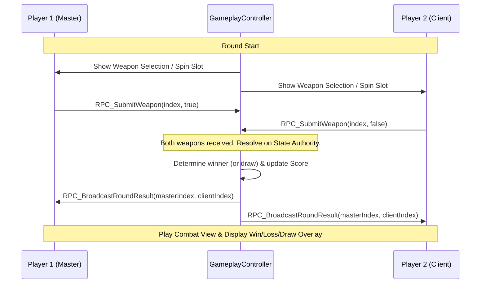

# Destiny of the Stone-hammer-saw — Project Guide & Analysis

This document serves as the developer entry point for **Destiny of the Stone-hammer-saw**, a 1v1 competitive multiplayer duel game built in Unity. It includes details about project architecture, technology frameworks, core mechanics, script directory index, scene purposes, and key areas of focus.

---

## 1. Project Overview & Architecture

**Destiny of the Stone-hammer-saw** is a 1v1 quick-draw weapon selection game. The core gameplay loops consist of players connecting to a match, selecting weapons simultaneously within a brief selection period (handled via an automatic/interactive scroll-wheel slot machine interface), resolving the winner of each round via a 5-weapon Rock-Paper-Scissors extension, and viewing procedural combat animations in a 3D battle arena.

The project incorporates:
*   **Networking Engine**: Photon Fusion (v2) in **Shared Mode** (synchronized room management, networked states, and RPC calls).
*   **User Interface**: Custom Unity Canvas + event callbacks styled with DOTween animations (transitioning from slot machine mechanics to modern vertical carousel setups).
*   **Controls & Locomotion**: Dual-input character locomotion (Mouse/Keyboard or on-screen [SimpleMobileJoystick](file:///C:/Users/User/Documents/GitHub/unity.deonphizzle.stone-hammer-saw/Assets/Scripts/Controller/SimpleMobileJoystick.cs)) paired with an orbit camera.
*   **Procedural Animation**: Dynamic bone rotation overrides via DOTween and procedural walk/breathing cycle code to handle combat strikes and walking without animations getting overridden by animator assets.

---

## 2. Directory Structure & Script Index

All project logic is located under the `Assets/Scripts/` directory, broken down by responsibility:

```
Assets/Scripts/
├── Multiplayer/
│   └── MatchmakingManager.cs        # Session creation, player joining callbacks (Photon Fusion)
├── Controller/
│   ├── GameplayController.cs        # Round rules, score tracking, winner calculation, RPCs
│   ├── SlotMachineManager.cs        # Automated vertical slot machine weapon rotation UI controller
│   ├── SlotMachineSelector.cs       # Selects and snaps weapon items in slot layout
│   ├── SimpleMobileJoystick.cs      # Touch-draggable virtual joystick sending Vector2 outputs
│   ├── VirtualJoystick.cs           # Secondary draggable joystick component supporting dynamic placement
│   ├── ThirdPersonCharacterController.cs  # Character movement, jumping, jumping triggers & camera input listener
│   ├── ThirdPersonCameraController.cs  # Camera target-orbit tracking, manual swipe rotation & auto-alignment
│   ├── DOTweenCombatController.cs   # Procedural bone strike/anticipation sequence triggers
│   ├── ProceduralHumanoidAnimator.cs # Custom procedural skeleton runner for gait/walking and breathing cycles
│   └── SceneOrientationController.cs # Landscape locks screen settings per scene
├── View/
│   └── UIManager.cs                 # Loading progress bars, UI Panels switcher, scoring UI labels
├── Editor/
│   ├── ThirdPersonSetupHelper.cs    # Automated player humanoid setup & camera detachment script
│   └── WeaponScrollSetupHelper.cs   # Formats scroll view contents layout size in Edit Mode
└── Deprecated Reference Files/
    ├── CODE_ARCHITECTURE_PREVIEW.md # Deprecated Blueprint reference
    ├── IMPLEMENTATION_CHECKLIST.md  # Deprecated implementation checklist
    └── MULTIPLAYER_INTEGRATION_GUIDE.md # Deprecated integration guide
```

---

## 3. Core Component Registry & Clickable References

### 3.1 Multiplayer & Lobby Management
*   **[MatchmakingManager](file:///C:/Users/User/Documents/GitHub/unity.deonphizzle.stone-hammer-saw/Assets/Scripts/Multiplayer/MatchmakingManager.cs)**: Handles starting the Fusion session with `GameMode.Shared`. Registers callbacks for new connections (`INetworkRunnerCallbacks`) and starts loading scenes synchronously once two players enter the lobby.
*   **[GameplayController](file:///C:/Users/User/Documents/GitHub/unity.deonphizzle.stone-hammer-saw/Assets/Scripts/Controller/GameplayController.cs)**: The authoritative logic coordinator. Inherits from `NetworkBehaviour`. It holds state indicators like `round`, `masterScore`, and `clientScore`. Handles RPC weapon selection submission and evaluates round resolution securely.

### 3.2 Controls & Camera
*   **[ThirdPersonCharacterController](file:///C:/Users/User/Documents/GitHub/unity.deonphizzle.stone-hammer-saw/Assets/Scripts/Controller/ThirdPersonCharacterController.cs)**: Manages player walking/running based on keyboard (WASD) or virtual mobile joystick axes. Communicates movement parameters directly to the procedural animator.
*   **[ThirdPersonCameraController](file:///C:/Users/User/Documents/GitHub/unity.deonphizzle.stone-hammer-saw/Assets/Scripts/Controller/ThirdPersonCameraController.cs)**: Custom orbital tracking script. Tracks behind character controller transforms. Detects horizontal and vertical touch drags to rotate camera angles, resetting automatically when characters start moving.
*   **[SimpleMobileJoystick](file:///C:/Users/User/Documents/GitHub/unity.deonphizzle.stone-hammer-saw/Assets/Scripts/Controller/SimpleMobileJoystick.cs)**: Simple 2D container and tip handle controller used to input movement vectors on mobile devices.
*   **[VirtualJoystick](file:///C:/Users/User/Documents/GitHub/unity.deonphizzle.stone-hammer-saw/Assets/Scripts/Controller/VirtualJoystick.cs)**: A secondary screen pointer listener for multi-touch UI overlays.

### 3.3 Visual Presentation & Animations
*   **[UIManager](file:///C:/Users/User/Documents/GitHub/unity.deonphizzle.stone-hammer-saw/Assets/Scripts/View/UIManager.cs)**: Integrates UI views, countdown timer overlays, loading bars, score text indicators, round checklist stars, and displays the appropriate Win, Loss, or Draw overlay panels.
*   **[ProceduralHumanoidAnimator](file:///C:/Users/User/Documents/GitHub/unity.deonphizzle.stone-hammer-saw/Assets/Scripts/Controller/ProceduralHumanoidAnimator.cs)**: Traverses character transforms (`Waist`, `Spine`, `Thighs`, `Calves`, `Upperarms`) to animate running gaits, breathing cycles, and hand offsets without conventional Animator clip files.
*   **[DOTweenCombatController](file:///C:/Users/User/Documents/GitHub/unity.deonphizzle.stone-hammer-saw/Assets/Scripts/Controller/DOTweenCombatController.cs)**: Executes high-speed bone rotations to produce strike impacts, head-snapping reaction animations on target hit, camera screenshakes, and smooth recoveries to idle states.
*   **[SlotMachineManager](file:///C:/Users/User/Documents/GitHub/unity.deonphizzle.stone-hammer-saw/Assets/Scripts/Controller/SlotMachineManager.cs)** and **[SlotMachineSelector](file:///C:/Users/User/Documents/GitHub/unity.deonphizzle.stone-hammer-saw/Assets/Scripts/Controller/SlotMachineSelector.cs)**: Orchestrate the slot machine panel transitions, automating visual weapon item selection via scroll Rect offsets.

### 3.4 Tools & Editors
*   **[ThirdPersonSetupHelper](file:///C:/Users/User/Documents/GitHub/unity.deonphizzle.stone-hammer-saw/Assets/Scripts/Editor/ThirdPersonSetupHelper.cs)**: Automated workflow script accessible under `Tools/Setup Third Person Controller`. Set rig importer properties to Humanoid, configures animator controllers, pins movement controllers, and separates camera hierarchies.
*   **[WeaponScrollSetupHelper](file:///C:/Users/User/Documents/GitHub/unity.deonphizzle.stone-hammer-saw/Assets/Scripts/Editor/WeaponScrollSetupHelper.cs)**: Helper accessible under `Tools/Stone Hammer Saw/Setup Weapon Scroll View`. Auto-aligns spacing and Rect sizing elements to conform with UI cards layout.

---

## 4. Scenes & Sandboxes Guide

The project contains five primary scene assets:

1.  **[HomeScene.unity](file:///C:/Users/User/Documents/GitHub/unity.deonphizzle.stone-hammer-saw/Assets/Scenes/HomeScene.unity)**
    *   **Purpose**: The production starting point. Contains the complete game flow: Lobby Panel, character model select, player login fields, Fusion matchmaking runner setup, and the weapon selection UI slot manager.
2.  **[PonyPackScene.unity](file:///C:/Users/User/Documents/GitHub/unity.deonphizzle.stone-hammer-saw/Assets/Scenes/PonyPackScene.unity)**
    *   **Purpose**: Dedicated 3D combat/animation sandbox. Pre-built with platform structures, spotlight grids, Attacker and Victim models. Does not contain matchmaking scripts. Useful for debugging bone sequences.
3.  **[Mov Squad 3d world scene.unity](file:///C:/Users/User/Documents/GitHub/unity.deonphizzle.stone-hammer-saw/Assets/Mov%20Squad%203d%20world%20scene.unity)**
    *   **Purpose**: Controls sandbox scene. Utilizes [ThirdPersonCameraController](file:///C:/Users/User/Documents/GitHub/unity.deonphizzle.stone-hammer-saw/Assets/Scripts/Controller/ThirdPersonCameraController.cs) attached to a root camera node.
4.  **[Mob Squad 3d world scene.unity](file:///C:/Users/User/Documents/GitHub/unity.deonphizzle.stone-hammer-saw/Assets/Scenes/Mob%20Squad%203d%20world%20scene.unity)**
    *   **Purpose**: Alternate controls sandbox scene. Rigged camera is parented rigidly to character joints without rotation controllers.
5.  **[Mob-Squad-Scene.unity](file:///C:/Users/User/Documents/GitHub/unity.deonphizzle.stone-hammer-saw/Assets/Scenes/Mob-Squad-Scene.unity)**
    *   **Purpose**: Legacy control workspace.

---

## 5. Rules & Domination Logic

### 5.1 The 5-Weapon System
The game uses five weapons mapped to the following IDs:
*   `0`: Mini Saw
*   `1`: Big Saw
*   `2`: Hammer
*   `3`: Mini Stone
*   `4`: Big Stone

Weapon interactions are resolved in `DetermineWinner(mine, opp)` under `GameplayController.cs`:
*   **Mini Saw (0)** wins over Mini Stone (3). Loses to Big Saw (1), Hammer (2), Big Stone (4).
*   **Big Saw (1)** wins over Mini Saw (0). Loses to Hammer (2).
*   **Hammer (2)** wins over Mini Saw (0), Big Saw (1), Mini Stone (3). Loses to Big Stone (4).
*   **Mini Stone (3)** loses to all items (wins against nothing).
*   **Big Stone (4)** wins over Mini Saw (0), Mini Stone (3). Loses to Hammer (2).

> [!WARNING]
> **Dominance Asymmetry:** The matrix is mathematically imbalanced:
> *   `Mini Stone` (3) cannot win against any weapon.
> *   Some matchups (e.g., Big Saw vs. Big Stone, Big Stone vs. Big Saw) are undefined, defaulting to a Draw.
> *   **Recommendation**: Rebalance this grid to ensure symmetry (every weapon wins against two options and loses to two options).

### 5.2 Game Loop Sequence


---

## 6. Implementation Status & Roadmap

| Feature / System | Status | Source Scripts |
| :--- | :--- | :--- |
| **Matchmaking & Lobbies** | 🟢 Functional | [MatchmakingManager](file:///C:/Users/User/Documents/GitHub/unity.deonphizzle.stone-hammer-saw/Assets/Scripts/Multiplayer/MatchmakingManager.cs) |
| **Client Scene Synchronized Loading** | 🟢 Functional | [GameplayController](file:///C:/Users/User/Documents/GitHub/unity.deonphizzle.stone-hammer-saw/Assets/Scripts/Controller/GameplayController.cs) |
| **Weapon Spin Selection UI** | 🟢 Functional | [SlotMachineManager](file:///C:/Users/User/Documents/GitHub/unity.deonphizzle.stone-hammer-saw/Assets/Scripts/Controller/SlotMachineManager.cs) & [SlotMachineSelector](file:///C:/Users/User/Documents/GitHub/unity.deonphizzle.stone-hammer-saw/Assets/Scripts/Controller/SlotMachineSelector.cs) |
| **Score Sync & Game Rounds** | 🟢 Functional | [GameplayController](file:///C:/Users/User/Documents/GitHub/unity.deonphizzle.stone-hammer-saw/Assets/Scripts/Controller/GameplayController.cs) |
| **Locomotion Controls** | 🟢 Functional | [ThirdPersonCharacterController](file:///C:/Users/User/Documents/GitHub/unity.deonphizzle.stone-hammer-saw/Assets/Scripts/Controller/ThirdPersonCharacterController.cs) |
| **Orbit Camera Controller** | 🟢 Functional | [ThirdPersonCameraController](file:///C:/Users/User/Documents/GitHub/unity.deonphizzle.stone-hammer-saw/Assets/Scripts/Controller/ThirdPersonCameraController.cs) |
| **Procedural Humanoid Run/Idle** | 🟢 Functional | [ProceduralHumanoidAnimator](file:///C:/Users/User/Documents/GitHub/unity.deonphizzle.stone-hammer-saw/Assets/Scripts/Controller/ProceduralHumanoidAnimator.cs) |
| **Procedural Weapon Strikes** | 🟢 Functional | [DOTweenCombatController](file:///C:/Users/User/Documents/GitHub/unity.deonphizzle.stone-hammer-saw/Assets/Scripts/Controller/DOTweenCombatController.cs) |
| **Draw Score Handling & Draw UI** | 🟢 Functional | [GameplayController](file:///C:/Users/User/Documents/GitHub/unity.deonphizzle.stone-hammer-saw/Assets/Scripts/Controller/GameplayController.cs) & [UIManager](file:///C:/Users/User/Documents/GitHub/unity.deonphizzle.stone-hammer-saw/Assets/Scripts/View/UIManager.cs) |
| **Scroll View Setup Automations** | 🟢 Functional | [WeaponScrollSetupHelper](file:///C:/Users/User/Documents/GitHub/unity.deonphizzle.stone-hammer-saw/Assets/Scripts/Editor/WeaponScrollSetupHelper.cs) |
| **Tie-Breaker Timing Engine** | 🔴 Missing | *To be implemented. Measures millisecond latency of click timings to settle draws.* |

### Next Development Priorities:
1.  **Tie-Breaker Timing Engine**:
    *   Measure the duration from the start of the round's weapon selection phase to the exact millisecond a player locks in their decision.
    *   Sync this value over RPC.
    *   In the event of a draw by weapon dominance, reward the point to the player with the faster/better selection timing rating (e.g. Perfect, Great, Good).
2.  **5-Weapon Rebalancing**:
    *   Update `DetermineWinner` to follow a balanced five-point star relationship, ensuring each choice has exactly 2 targets it wins against and 2 targets it loses to.
