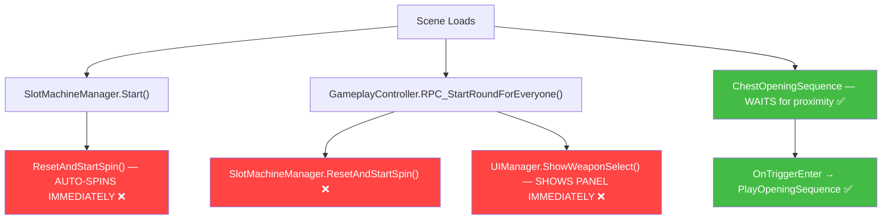

# 🎰 Character → Weapon‑Select → Box: Proximity‑Based Implementation Plan

## 🎯 Goal

> When the game starts, the slot machine should **NOT** auto‑spin.  
> Only when **Pangopal\_01** walks near the **Box**, the **WeoponSelect‑Panel‑Moiib Squad New** panel activates, the slot machine spins, and after selection the weapon flies into Pangopal\_01's hand.

---

## 📊 Current State Analysis

### What exists today

| Component | File | Current Behaviour |
|-----------|------|-------------------|
| `SlotMachineManager` | [SlotMachineManager.cs](file:///C:/Users/User/Documents/GitHub/unity.deonphizzle.stone-hammer-saw/Assets/Scripts/Controller/SlotMachineManager.cs) | **Auto‑spins on `Start()`** — calls `ResetAndStartSpin()` immediately when the scene loads. |
| `ChestOpeningSequence` | [ChestOpeningSequence.cs](file:///C:/Users/User/Documents/GitHub/unity.deonphizzle.stone-hammer-saw/Assets/Scripts/Controller/ChestOpeningSequence.cs) | ✅ **Already has proximity detection!** Has `OnTriggerEnter` that checks for `targetCharacterName` ("Pangopal\_01") and calls `PlayOpeningSequence()` → shows weapon panel → equips weapon to `CC_Base_R_Hand`. |
| `GameplayController` | [GameplayController.cs](file:///C:/Users/User/Documents/GitHub/unity.deonphizzle.stone-hammer-saw/Assets/Scripts/Controller/GameplayController.cs) | Calls `SlotMachineManager.ResetAndStartSpin()` in `RPC_StartRoundForEveryone()` at round start. Also calls `uiManager.ShowWeaponSelect()` which shows the panel immediately. |
| `UIManager` | [UIManager.cs](file:///C:/Users/User/Documents/GitHub/unity.deonphizzle.stone-hammer-saw/Assets/Scripts/View/UIManager.cs) | `ShowWeaponSelect()` activates the `weaponSelectPanel` and starts a 5s timer immediately. |
| `ThirdPersonCharacterController` | [ThirdPersonCharacterController.cs](file:///C:/Users/User/Documents/GitHub/unity.deonphizzle.stone-hammer-saw/Assets/Scripts/Controller/ThirdPersonCharacterController.cs) | Uses `CharacterController` (not Rigidbody). This is **critical** — `CharacterController` does NOT trigger `OnTriggerEnter` by default unless the Box's collider is set as a trigger and sized properly. |

### What's good — already working

`ChestOpeningSequence` already does **almost everything** you want:

```
Pangopal_01 walks near Box
    → OnTriggerEnter detects "Pangopal_01"
    → PlayOpeningSequence()
        → Chest shakes + lid opens
        → 1s delay → ShowWeaponSelectPanel()
            → Panel appears with 5 weapon buttons + 5s countdown
            → Player taps a weapon → SelectWeapon(index)
                → SpawnAndEquipWeapon(index)
                    → Weapon rises from chest
                    → Flies to CC_Base_R_Hand
                    → Attaches to hand with DOTween animation
                    → Attack trigger fires
```

### What's broken — the conflicts



**Two systems are fighting:**
1. `GameplayController` + `SlotMachineManager` → shows weapon panel **at game start** (multiplayer round‑based flow)
2. `ChestOpeningSequence` → shows weapon panel **on proximity** (3D world chest flow)

In the **Mob Squad 3D World scene**, only the chest flow should be active.

---

## 🔧 Required Changes

### Change 1: Stop `SlotMachineManager` from auto‑spinning on Start

**File:** [SlotMachineManager.cs](file:///C:/Users/User/Documents/GitHub/unity.deonphizzle.stone-hammer-saw/Assets/Scripts/Controller/SlotMachineManager.cs)  
**Problem:** `Start()` calls `ResetAndStartSpin()` immediately.  
**Fix:** Remove the auto‑spin from `Start()`. The slot machine should only spin when explicitly triggered.

```diff
 void Start()
 {
-    ResetAndStartSpin();
+    // Don't auto-spin. Wait for ChestOpeningSequence to trigger us.
+    isSpinning = false;
 }
```

### Change 2: Connect `SlotMachineManager` to `ChestOpeningSequence` flow

**File:** [ChestOpeningSequence.cs](file:///C:/Users/User/Documents/GitHub/unity.deonphizzle.stone-hammer-saw/Assets/Scripts/Controller/ChestOpeningSequence.cs)  
**Problem:** `ChestOpeningSequence` already has its own weapon selection UI (procedural buttons + countdown). It does NOT currently use `SlotMachineManager` at all — it has its own parallel system.  
**Fix:** After the chest opens and the panel is shown, also start the slot machine spin.

```diff
 private void ShowWeaponSelectPanel()
 {
     // ... existing panel activation code ...
 
+    // Start the slot machine spinning now that the panel is visible
+    SlotMachineManager slotMachine = FindObjectOfType<SlotMachineManager>();
+    if (slotMachine != null)
+    {
+        slotMachine.ResetAndStartSpin();
+        // Subscribe to slot machine selection event
+        slotMachine.OnWeaponSelected -= OnSlotMachineWeaponSelected;
+        slotMachine.OnWeaponSelected += OnSlotMachineWeaponSelected;
+    }
 
     // Start the 5-second countdown timer
     if (countdownCoroutine != null) StopCoroutine(countdownCoroutine);
     countdownCoroutine = StartCoroutine(StartCountdownTimer());
 }
+
+ private void OnSlotMachineWeaponSelected(int index)
+ {
+     SelectWeapon(index);
+ }
```

### Change 3: Ensure the weapon panel starts HIDDEN

**File:** [UIManager.cs](file:///C:/Users/User/Documents/GitHub/unity.deonphizzle.stone-hammer-saw/Assets/Scripts/View/UIManager.cs)  
**Problem:** The Mob Squad scene may show the weapon panel immediately through `GameplayController`.  
**Fix:** In the Mob Squad scene, the weapon panel should start inactive. `ChestOpeningSequence` already activates it when the player approaches the Box. No code change needed if the panel is set inactive in the scene hierarchy (which `WeaponSelectSetupHelper` already does: `instantiatedPanel.SetActive(false)`).

However, `GameplayController.RPC_StartRoundForEveryone()` still calls `uiManager.ShowWeaponSelect()`. This needs to be guarded:

```diff
 [Rpc(RpcSources.StateAuthority, RpcTargets.All)]
 public void RPC_StartRoundForEveryone()
 {
     // ... reset code ...
 
-    if (uiManager != null)
-    {
-        uiManager.ShowWeaponSelect();
-        uiManager.UpdateRoundUI(round, myScore, enemyScore);
-    }
-
-    // Reset and start spin slot machine
-    SlotMachineManager slotMachine = FindObjectOfType<SlotMachineManager>();
-    if (slotMachine != null)
-    {
-        slotMachine.ResetAndStartSpin();
-    }
+    // In Mob Squad 3D scene, weapon selection is triggered by ChestOpeningSequence
+    // Only show weapon select automatically if ChestOpeningSequence is NOT present
+    ChestOpeningSequence chestSequence = FindObjectOfType<ChestOpeningSequence>();
+    if (chestSequence == null)
+    {
+        // Original multiplayer flow — show panel + spin immediately
+        if (uiManager != null)
+        {
+            uiManager.ShowWeaponSelect();
+            uiManager.UpdateRoundUI(round, myScore, enemyScore);
+        }
+        SlotMachineManager slotMachine = FindObjectOfType<SlotMachineManager>();
+        if (slotMachine != null)
+        {
+            slotMachine.ResetAndStartSpin();
+        }
+    }
+    else
+    {
+        // Mob Squad scene — just update round UI, let chest proximity handle weapon select
+        if (uiManager != null)
+        {
+            uiManager.UpdateRoundUI(round, myScore, enemyScore);
+        }
+    }
 }
```

### Change 4: Ensure `OnTriggerEnter` actually fires (Physics fix)

**Problem:** `Pangopal_01` uses `CharacterController` (not `Rigidbody`). Unity's trigger detection between a `CharacterController` and a `BoxCollider(isTrigger=true)` **does work** — `CharacterController.Move()` fires `OnTriggerEnter` on trigger colliders it passes through. **No physics change needed.**

`ChestOpeningSequence.Start()` already:
- Gets the `BoxCollider` on the Box
- Sets `isTrigger = true`
- Expands its size to 1.8×1.5×1.8 for reliable detection
- Adjusts center upward

✅ **This is correct and will work with `CharacterController`.**

### Change 5: Ensure weapon equip-to-hand works properly

**Already implemented!** `ChestOpeningSequence.SpawnAndEquipWeapon()` at [line 375](file:///C:/Users/User/Documents/GitHub/unity.deonphizzle.stone-hammer-saw/Assets/Scripts/Controller/ChestOpeningSequence.cs#L375-L517) already:

1. Finds `CC_Base_R_Hand` on the player character
2. Destroys any previously equipped weapon
3. Creates the weapon (Hammer from prefab, others procedurally)
4. Animates it rising from chest → floating mid‑air → flying to hand
5. Parents it to hand bone with exact offset/rotation
6. Fires the `Attack` animation trigger

---

## 🔄 Complete Flow After Changes

```mermaid
sequenceDiagram
    participant Player as Pangopal_01
    participant Box as Box (ChestOpeningSequence)
    participant Panel as WeoponSelect-Panel
    participant Slot as SlotMachineManager
    participant Hand as CC_Base_R_Hand

    Note over Player,Box: Scene loads — Panel HIDDEN, Slot NOT spinning
    Player->>Player: Walk around 3D world freely
    Player->>Box: Walk near Box (OnTriggerEnter)
    Box->>Box: PlayOpeningSequence()
    Box->>Box: Shake chest + Open lid
    Box->>Box: Play glow VFX + burst particles
    Note over Box: 1 second delay
    Box->>Panel: SetActive(true)
    Box->>Slot: ResetAndStartSpin()
    Slot->>Slot: Spin for 3 seconds
    Note over Panel: Countdown timer: 5s
    
    alt Player taps a weapon button
        Panel->>Box: SelectWeapon(index)
    else Slot machine stops after 3s
        Slot->>Slot: StopSpinning() → snap to slot
        Slot->>Box: OnWeaponSelected(index)
        Box->>Box: SelectWeapon(index)
    else Timer expires (5s)
        Box->>Box: Auto-select Hammer (index 2)
    end
    
    Box->>Panel: SetActive(false)
    Box->>Box: SpawnAndEquipWeapon(index)
    Box->>Box: Weapon rises from chest (DOTween)
    Box->>Box: Weapon floats mid-air + spins
    Box->>Box: Trail VFX particles
    Box->>Hand: Weapon flies to CC_Base_R_Hand
    Box->>Hand: Parent weapon to hand bone
    Box->>Hand: Punch scale impact + flash VFX
    Box->>Player: Animator.SetTrigger("Attack")
```

---

## 📁 Files to Modify (Summary)

| File | Change | Risk |
|------|--------|------|
| [SlotMachineManager.cs](file:///C:/Users/User/Documents/GitHub/unity.deonphizzle.stone-hammer-saw/Assets/Scripts/Controller/SlotMachineManager.cs) | Remove `ResetAndStartSpin()` from `Start()` | 🟢 Low — only removes auto‑spin |
| [ChestOpeningSequence.cs](file:///C:/Users/User/Documents/GitHub/unity.deonphizzle.stone-hammer-saw/Assets/Scripts/Controller/ChestOpeningSequence.cs) | Add `SlotMachineManager` integration in `ShowWeaponSelectPanel()` | 🟡 Medium — adds new event subscription |
| [GameplayController.cs](file:///C:/Users/User/Documents/GitHub/unity.deonphizzle.stone-hammer-saw/Assets/Scripts/Controller/GameplayController.cs) | Guard `ShowWeaponSelect()` + `ResetAndStartSpin()` behind `ChestOpeningSequence` check | 🟡 Medium — changes multiplayer round flow |

### Files that DON'T need changes
| File | Why |
|------|-----|
| `UIManager.cs` | Panel visibility is already managed by `ChestOpeningSequence` |
| `ThirdPersonCharacterController.cs` | `CharacterController.Move()` already triggers `OnTriggerEnter` |
| `WeaponSelectSetupHelper.cs` | Editor script — already wires references correctly |

---

## ⚠️ Edge Cases to Consider

| Edge Case | Handling |
|-----------|----------|
| **Player walks away from Box during selection** | Currently no `OnTriggerExit` logic. The panel stays until selection or timer expires. Consider adding auto‑cancel if player exits trigger zone. |
| **Box opened twice** | `isOpened = true` flag prevents re‑triggering. ✅ Already handled. |
| **No `SlotMachineManager` in scene** | `FindObjectOfType` returns null, falls back to procedural buttons + countdown. ✅ Already handled. |
| **Multiplayer scene (not Mob Squad)** | The `ChestOpeningSequence` check in `GameplayController` ensures original flow works when there's no chest. ✅ Handled by Change 3. |
| **Weapon already equipped** | `SpawnAndEquipWeapon` destroys any child named `Equipped_*` before spawning new one. ✅ Already handled. |

---

## 🧪 Testing Checklist

- [ ] Launch Mob Squad 3D world scene
- [ ] Confirm weapon select panel is **HIDDEN** on load
- [ ] Confirm slot machine is **NOT spinning** on load
- [ ] Walk Pangopal\_01 towards the Box
- [ ] Verify chest shakes → lid opens → VFX plays
- [ ] After 1s delay, verify panel appears with weapon buttons
- [ ] Verify slot machine starts spinning
- [ ] Tap a weapon button — confirm weapon spawns and flies to right hand
- [ ] Verify weapon is parented to `CC_Base_R_Hand` with correct offset
- [ ] Verify Attack animation triggers
- [ ] Wait for timer to expire — confirm auto‑selects Hammer
- [ ] Try walking to Box again — confirm it does NOT re‑trigger

---

*Generated by Antigravity – your AI coding partner.*
