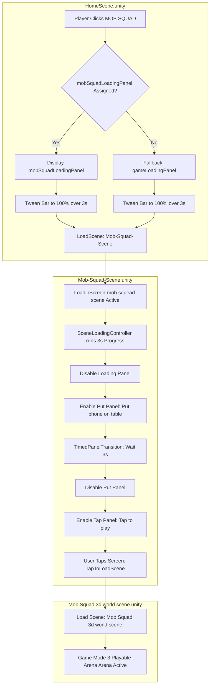

# Pungopups Party Games (Destiny of the Stone-hammer-saw) — Game Progress & Status Tracker

This document provides a comprehensive progress tracker, architecture analysis, and developer roadmap for **Pungopups Party Games** (also referred to inside the codebase as **Destiny of the Stone-hammer-saw**), a 3D multiplayer mini-game suite built in Unity.

---

## 1. Project Context & Architecture

The project is a multiplayer party suite featuring three mini-games. It is designed around the following architectural core:
*   **Engine & Rendering:** Unity with Universal Render Pipeline (URP).
*   **Networking Engine:** **Photon Fusion 2** in **Shared Mode** (synchronizing player joining, room status, networked properties, and cross-client RPC messages).
*   **UI System:** Custom Unity Screen-Space Canvas paired with **DOTween** animations for panel transitions, loading bar tweens, and card selectors.
*   **Locomotion & Camera:** Draggable joystick inputs ([SimpleMobileJoystick](file:///C:/Users/User/Documents/GitHub/unity.deonphizzle.stone-hammer-saw/Assets/Scripts/Controller/SimpleMobileJoystick.cs)) and orbit cameras tracking rigged players.
*   **Animations:** Fully **procedural skeletal animation** system using code ([ProceduralHumanoidAnimator](file:///C:/Users/User/Documents/GitHub/unity.deonphizzle.stone-hammer-saw/Assets/Scripts/Controller/ProceduralHumanoidAnimator.cs) for idle/breathing/run gaits, and [DOTweenCombatController](file:///C:/Users/User/Documents/GitHub/unity.deonphizzle.stone-hammer-saw/Assets/Scripts/Controller/DOTweenCombatController.cs) for strike impulses) to bypass standard Animator controller overrides and maintain raw responsiveness.

---

## 2. Git Branch Status & Integration Check

The repository contains three main branches:
1.  **`main`**: The base import branch (2 commits).
2.  **`previous-stable-version`** (Active Checkout): The primary working codebase containing 113 commits. This contains the full UI overlays, matchmaking, loading screens, and scene workflows.
3.  **`development`**: A diverged legacy workspace branch with 14 commits.
4.  **`origin/Dev_F`**: An active development branch containing the gyroscope stability checks and mobile sensors integration logic (`GyroDetector.cs`, `GyroUIHandler.cs`, `GyroState.cs`).

> [!IMPORTANT]
> **Integration Required:**
> The gyroscope detection systems necessary to run **Game Mode 2 (Pony Pack)** are located exclusively on `origin/Dev_F`. They must be merged into the active `previous-stable-version` branch to enable the gyroscope-based quick-draw mechanics.

---

## 3. Mini-Games Status Analysis

### 🎮 Game Mode 1: Stone Saw Hammer (1v1 Rock-Paper-Scissors Duel)
*   **Status:** 🟢 Functional
*   **Details:** Two players join a room via Photon Fusion matchmaking, click ready, watch a synchronized loading screen, spin a vertical slot-machine selector to freeze on a weapon choice, and watch procedural combat strikes play out in the arena.
*   **Imbalances & Issues:**
    1.  **Weapon Balance:** The 5-weapon dominance rules defined inside [GameplayController.DetermineWinner()](file:///C:/Users/User/Documents/GitHub/unity.deonphizzle.stone-hammer-saw/Assets/Scripts/Controller/GameplayController.cs#L294) are imbalanced:
        *   `Mini Stone` (3) cannot win against any weapon.
        *   Matches like `Big Saw` vs. `Big Stone` result in undefined Draw default behaviors.
    2.  **Missing Latency Tie-Breaker:** When both players choose the same/drawing weapons, the tie-breaker engine measuring millisecond lock-in speed is missing.

### 🎮 Game Mode 2: Pony Pack (Reaction Speed Match)
*   **Status:** 🟡 In Progress / Sandbox
*   **Details:** Players must place their mobile phones flat on a table (stillness check) and quickly pick them up when the music suddenly stops.
*   **Progress:**
    *   *Branch `previous-stable-version`:* The arena environment [PonyPackScene.unity](file:///C:/Users/User/Documents/GitHub/unity.deonphizzle.stone-hammer-saw/Assets/Scenes/PonyPackScene.unity) is completed with lights and characters. The local overlays and instruction screen progression panels ("Put the Phone on Table" -> "Tap to play") are fully wired.
    *   *Branch `Dev_F`:* The gyroscope sensors, stillness delta checks, and pickup time window detection loops are fully implemented inside `GyroDetector.cs`.

### 🎮 Game Mode 3: Mob Squad (Musical Chairs Battle Royale)
*   **Status:** 🟢 UI & Environment Complete / 🟡 Gameplay Logic In-Progress
*   **Details:** A 5-8 player arena run. Players run to a central table when music cuts out, grab a mystical item box, and attack nearby players.
*   **Progress:**
    *   The UI loading transition overlays and scene redirections are completed (transitions from [HomeScene.unity](file:///C:/Users/User/Documents/GitHub/unity.deonphizzle.stone-hammer-saw/Assets/Scenes/HomeScene.unity) through `Mob-Squad-Scene` instructions to the final 3D workspace).
    *   The 3D props (Arena Gates, Mystical Box FBX models) have been successfully imported and positioned inside [Mob Squad 3d world scene.unity](file:///C:/Users/User/Documents/GitHub/unity.deonphizzle.stone-hammer-saw/Assets/Scenes/Mob%20Squad%203d%20world%20scene.unity).
    *   Player movement controls (joysticks, keyboard) and orbit camera rotations are functional.

---

## 4. Detailed Implementation Checklist

| Module / Feature | Status | Description | Associated Scripts |
| :--- | :--- | :--- | :--- |
| **Photon Fusion Matchmaking** | 🟢 Complete | Shared Mode session setup and client/host lobby syncing. | [MatchmakingManager.cs](file:///C:/Users/User/Documents/GitHub/unity.deonphizzle.stone-hammer-saw/Assets/Scripts/Multiplayer/MatchmakingManager.cs) |
| **App-Launch Loader** | 🟢 Complete | Local loading slider animation using DOTween. | [UIManager.cs](file:///C:/Users/User/Documents/GitHub/unity.deonphizzle.stone-hammer-saw/Assets/Scripts/View/UIManager.cs) |
| **Lobby-to-Game Loading** | 🟢 Complete | Synchronized 3s slider for Host & Client prior to match starting. | [GameplayController.cs](file:///C:/Users/User/Documents/GitHub/unity.deonphizzle.stone-hammer-saw/Assets/Scripts/Controller/GameplayController.cs) |
| **Scene-Local Loading Redirects** | 🟢 Complete | Fills 3s loading bar on scene load then redirects to instructions. | [SceneLoadingController.cs](file:///C:/Users/User/Documents/GitHub/unity.deonphizzle.stone-hammer-saw/Assets/Scripts/Controller/SceneLoadingController.cs) |
| **Timed Panel Transitions** | 🟢 Complete | Auto-cycles instructions panels after a set wait period. | [TimedPanelTransition.cs](file:///C:/Users/User/Documents/GitHub/unity.deonphizzle.stone-hammer-saw/Assets/Scripts/Controller/TimedPanelTransition.cs) |
| **Tap to Action Interfaces** | 🟢 Complete | Overlay touch controllers to dismiss screens or load maps. | [TapToClosePanel.cs](file:///C:/Users/User/Documents/GitHub/unity.deonphizzle.stone-hammer-saw/Assets/Scripts/Controller/TapToClosePanel.cs), [TapToLoadScene.cs](file:///C:/Users/User/Documents/GitHub/unity.deonphizzle.stone-hammer-saw/Assets/Scripts/Controller/TapToLoadScene.cs) |
| **Card Slot Spinner Selection** | 🟢 Complete | Automatic spinning vertical weapon carousel snapping on clicks. | [SlotMachineManager.cs](file:///C:/Users/User/Documents/GitHub/unity.deonphizzle.stone-hammer-saw/Assets/Scripts/Controller/SlotMachineManager.cs) |
| **Draggable Mobile Joysticks** | 🟢 Complete | Screen pointer anchors supplying 2D movement signals. | [SimpleMobileJoystick.cs](file:///C:/Users/User/Documents/GitHub/unity.deonphizzle.stone-hammer-saw/Assets/Scripts/Controller/SimpleMobileJoystick.cs), [VirtualJoystick.cs](file:///C:/Users/User/Documents/GitHub/unity.deonphizzle.stone-hammer-saw/Assets/Scripts/Controller/VirtualJoystick.cs) |
| **3D Orbit Camera Tracking** | 🟢 Complete | Smooth orbit following targeting character rig hips. | [ThirdPersonCameraController.cs](file:///C:/Users/User/Documents/GitHub/unity.deonphizzle.stone-hammer-saw/Assets/Scripts/Controller/ThirdPersonCameraController.cs) |
| **Procedural Gait Controller** | 🟢 Complete | Code-based hips bobbing, thigh swings, and elbow bends. | [ProceduralHumanoidAnimator.cs](file:///C:/Users/User/Documents/GitHub/unity.deonphizzle.stone-hammer-saw/Assets/Scripts/Controller/ProceduralHumanoidAnimator.cs) |
| **Procedural Weapon Strikes** | 🟢 Complete | Fast bone rotations, victim head recoils, and screen shakes. | [DOTweenCombatController.cs](file:///C:/Users/User/Documents/GitHub/unity.deonphizzle.stone-hammer-saw/Assets/Scripts/Controller/DOTweenCombatController.cs) |
| **Gyroscope Stability Checks** | 🟡 In-Dev | Movement sensitivity & gravity angle check routines. | *Implemented in `origin/Dev_F` branches.* |
| **Symmetric 5-Weapon Hierarchy** | 🔴 Planned | Rebalance `DetermineWinner` logic so each item has 2 wins/losses. | *Pending editor scripts / logic rewrites.* |
| **Lock-in Timing Tie-Breaker** | 🔴 Planned | Measure lock duration to settle draws via faster reactions. | *Pending millisecond timers in GameplayController.* |

---

## 5. System Interaction Flow

The diagram below maps how the various loading screens, scene redirection controllers, and overlays coordinate during transition from the Main Menu to Game Mode 3 (Mob Squad):

---

## 6. Developer Action Items (Roadmap)

### Priority 1: Merge Gyroscope Stability Checks
*   **Task:** Merge branch `origin/Dev_F` into `previous-stable-version`.
*   **Goal:** Integrate `GyroDetector.cs` and `GyroUIHandler.cs` to enable the gyroscope-based stability checks in `PonyPackScene.unity`.
*   **Details:** Ensure the `Input.gyro.enabled = true` call is supported on mobile devices and falls back safely to keyboard input inside the Unity Editor.

### Priority 2: Fix 5-Weapon Dominance Matrix Asymmetry
*   **Task:** Update `DetermineWinner(mine, opp)` in `GameplayController.cs`.
*   **Goal:** Ensure a balanced 5-weapon Rock-Paper-Scissors setup.
*   **Recommendation:** Map weapons `0` through `4` to a standard symmetric cycle (e.g. each weapon beats $mine - 1 \pmod 5$ and $mine - 3 \pmod 5$, or similar five-point star math).

### Priority 3: Add Click-Timing Tie-Breaker Engine
*   **Task:** Track the elapsed time in seconds/milliseconds from the start of the weapon selection phase to the exact moment `SelectWeapon()` is called on each client.
*   **Goal:** Settle draws. If two players choose weapons that draw (e.g., both choose Hammer), the player who locked in their selection faster gets awarded the round point.
*   **Details:** Add a networked float/int parameter representing timing latencies in the submission RPCs.

### Priority 4: Implement Mob Squad Survival Loop
*   **Task:** Build the multiplayer run/tag logic for Mob Squad.
*   **Goal:** Synchronize player positions, trigger automatic tool sweeps when interacting with the table box, and execute player eliminations across the network.
