# HomeScene Loading Panels & Hierarchy Analysis

This document provides a detailed technical analysis of how the loading screen systems in [HomeScene.unity](file:///C:/Users/User/Documents/GitHub/unity.deonphizzle.stone-hammer-saw/Assets/Scenes/HomeScene.unity) are structured in the Hierarchy and programmed via code.

---

## 1. Flowchart of the Loading Flows

```mermaid
graph TD
    %% App Loading Flow
    subgraph App Launch Flow
        Start[Unity Start] --> UIManagerStart[UIManager.Start]
        UIManagerStart --> ShowAppPanel[Enable Loading-Panel-Homscene]
        ShowAppPanel --> AnimateApp[DOTween fillAmount 0 -> 1 over 3s]
        AnimateApp --> CompleteApp[Open characterSelectionPanel]
    end

    %% Matchmaking Loading Flow
    subgraph Multiplayer Match Loading Flow
        P1Ready[Host Ready] & P2Ready[Client Ready] --> CheckReady{Both Ready?}
        CheckReady -- Yes (On Host) --> BroadcastRPC[RPC_StartLoadingForEveryone]
        BroadcastRPC --> StartGameLoading[UIManager.StartGameSpecificLoading]
        StartGameLoading --> AnimateGame[DOTween fillAmount 0 -> 1 over 3s]
        AnimateGame --> TriggerRound[GameplayController.StartGameRound]
    end
```



---

## 2. System 1: App Launch Loading (`Loading-Panel-Homscene`)

This loading sequence runs locally on the player's device upon launching the game, acting as a visual splash transition.

### 2.1 Scene Hierarchy Structure
In [HomeScene.unity](file:///C:/Users/User/Documents/GitHub/unity.deonphizzle.stone-hammer-saw/Assets/Scenes/HomeScene.unity), the GameObject represents the primary splash panel:

*   **`Loading-Panel-Homscene`** (`fileID: 912880574`) — The parent panel.
    *   References the `appLoadingPanel` variable in [UIManager.cs](file:///C:/Users/User/Documents/GitHub/unity.deonphizzle.stone-hammer-saw/Assets/Scripts/View/UIManager.cs).
    *   Equipped with a full-screen background Image component.
    *   **Children**:
        *   **`BG-progress`** (`fileID: 1092502496`) — The background container for the loading bar slider.
            *   **Child**: An Image component configured with **Filled Image Type** (`fileID: 496943632`), bound to `appLoadingBar` in the script.
        *   **`LoadingText`** (`fileID: 1451645388` / TMPro) — Displays the message "Loading...", bound to `appLoadingText` in the script.

### 2.2 Visual Transition Execution Code
1.  **Scene Entry**: In [UIManager.cs](file:///C:/Users/User/Documents/GitHub/unity.deonphizzle.stone-hammer-saw/Assets/Scripts/View/UIManager.cs), the `Start()` callback triggers the flow:
    ```csharp
    private void Start()
    {
        ShowPanel(appLoadingPanel);
        StartAppLoading();
    }
    ```
2.  **Panel Switching**: `ShowPanel` disables all main Canvas UI screens and enables `Loading-Panel-Homscene`.
3.  **Visual Animations**:
    *   Fades the loading text (`appLoadingText`) back and forth continuously using a DOTween looping Yoyo animation over a 0.5s period.
    *   Smoothly fills the `appLoadingBar` from `0` to `1` over **3 seconds** using a linear tween:
    ```csharp
    appLoadingBar.DOFillAmount(1f, 3f).OnComplete(() =>
    {
        if(appLoadingText != null) appLoadingText.DOKill();
        ShowPanel(characterSelectionPanel); 
    });
    ```
4.  **Completion**: Once the 3-second bar animation completes, the looping text fades are terminated, and the panel transitions to the Character Selection screen.

---

## 3. System 2: Synchronized Game Loading (`gameLoadingPanel`)

This loading sequence runs during matchmaking when two players connect, providing a synchronized transition from lobby select screens to the actual game duel.

### 3.1 Network Initialization & Check
When players join the Fusion session in Shared Mode:
1.  **State Authority (Host)**: Sets `isHostReady = true` inside `Spawned()`.
2.  **Client**: Calls the remote RPC `RPC_ReportReadyToHost()` on the Host:
    ```csharp
    [Rpc(RpcSources.All, RpcTargets.StateAuthority)]
    public void RPC_ReportReadyToHost()
    {
        isClientReady = true;
        TryStartGameLoading();
    }
    ```
3.  **Lobby Synchronization Check**:
    ```csharp
    private void TryStartGameLoading()
    {
        if (Object.HasStateAuthority && isHostReady && isClientReady)
        {
            RPC_StartLoadingForEveryone();
        }
    }
    ```

### 3.2 Simultaneous Execution
1.  The Host broadcasts `RPC_StartLoadingForEveryone` to all instances:
    ```csharp
    [Rpc(RpcSources.StateAuthority, RpcTargets.All)]
    public void RPC_StartLoadingForEveryone()
    {
        if (uiManager != null)
        {
            uiManager.StartGameSpecificLoading(() => 
            {
                StartGameRound();
            });
        }
    }
    ```
2.  Both client and host execute `StartGameSpecificLoading(onComplete)` concurrently.
3.  **UI Animation**: The `gameLoadingPanel` is enabled, the progress bar resets (`gameLoadingBar.fillAmount = 0f`), and is tweened to `1f` over **3 seconds**:
    ```csharp
    public void StartGameSpecificLoading(System.Action onComplete)
    {
        ShowPanel(gameLoadingPanel);
        if (gameLoadingBar != null)
        {
            gameLoadingBar.fillAmount = 0f;
            gameLoadingBar.DOFillAmount(1f, 3f).OnComplete(() => onComplete?.Invoke());
        }
        else onComplete?.Invoke(); 
    }
    ```
4.  **Gameplay Trigger**: Once the 3-second loading completion callback is fired, it invokes the anonymous method pointing to `StartGameRound()`, initializing the card slot spinner and selection timers.

---

## 4. System 3: Mob Squad Loading Screen (`mobSquadLoadingPanel`)

When transitioning to the **Mob Squad** scene (`Mob-Squad-Scene`), a dedicated loading screen transition is supported before the scene is actually loaded.

### 4.1 Transition Flow
1.  **User Trigger**: The player clicks the **MOB SQUAD** button in the `gameSelectionPanel`.
2.  **Panel Evaluation**: `UIManager.OnMobSquadButtonClicked()` checks if `mobSquadLoadingPanel` is assigned in the Inspector:
    *   **If Assigned**: Displays the custom `mobSquadLoadingPanel`, resets `mobSquadLoadingBar.fillAmount = 0f`, and tweens it to `1f` (100% full) over **3 seconds** using DOTween. Upon completion, it loads the `Mob-Squad-Scene`.
    *   **Fallback (If Null)**: Triggers the generic `StartGameSpecificLoading()` transition to display the default multiplayer loading screen, and loads the scene upon its 3-second completion callback.
3.  **Registration**: `mobSquadLoadingPanel` is automatically disabled inside `ShowPanel(panelToShow)` to ensure UI cleanliness when showing other panels.

---

## 5. System 4: Scene-Local Loading Redirects (`SceneLoadingController`)

Once the game scenes (`Mob-Squad-Scene` or `PonyPackScene`) are loaded, they execute a scene-local loading screen animation before revealing the game instructions panel.

### 5.1 Scene 1: Mob-Squad-Scene Configuration
*   **Scene Loading Panel**: `'LoadinScreen-mob squead scene '` (`fileID: 1857412072`) is active on load and holds the [SceneLoadingController](file:///C:/Users/User/Documents/GitHub/unity.deonphizzle.stone-hammer-saw/Assets/Scripts/Controller/SceneLoadingController.cs) script.
*   **Redirect Target**: The `redirectPanel` parameter is mapped to the **`Put`** GameObject (`fileID: 1582699056`), which displays the "Put the Phone in Table" instruction panel.

### 5.2 Scene 2: PonyPackScene Configuration
*   **Scene Loading Panel**: `'LoadinScreen -PonyPack'` (`fileID: 458618017`) is active on load and holds the [SceneLoadingController](file:///C:/Users/User/Documents/GitHub/unity.deonphizzle.stone-hammer-saw/Assets/Scripts/Controller/SceneLoadingController.cs) script.
*   **Redirect Target**: The `redirectPanel` parameter is mapped to the **`Put (1)`** GameObject (`fileID: 2147452022`), which displays the "Put the Phone in Table" instruction panel.

### 5.3 Transition Logic
1.  On scene `Start()`, `SceneLoadingController` resets and starts filling the progress bar Image (fill amount: `0f` $\rightarrow$ `1f`) over **3 seconds**.
3.  Once completed, the loading panel deactivates (`loadingPanel.SetActive(false)`) and the respective redirect instruction panel is set active:
    ```csharp
    loadingPanel.SetActive(false);
    if (redirectPanel != null)
    {
        redirectPanel.SetActive(true);
    }
    ```

---

## 6. System 5: Post-Load Instruction Progression (`TimedPanelTransition`)

For the **Mob Squad** mode, there is a multi-step instruction progression sequence after loading completes:

1.  **Phase 1: Put Phone Panel**: Loaded via redirect from the loading controller. The **`Put`** panel (`fileID: 1582699056`) runs the [TimedPanelTransition](file:///C:/Users/User/Documents/GitHub/unity.deonphizzle.stone-hammer-saw/Assets/Scripts/Controller/TimedPanelTransition.cs) script.
2.  **Phase 2: Transition (3s Delay)**: When `Put` is set active, `TimedPanelTransition` triggers:
    ```csharp
    DOVirtual.DelayedCall(waitDuration, () => {
        currentPanel.SetActive(false); // Hides 'Put' panel
        nextPanel.SetActive(true);    // Shows 'Tap' panel
    });
    ```
3.  **Phase 3: Tap Panel**: The **`Tap`** panel (`fileID: 1230892216`) is set active to present the "TAP TO PLAY" overlay to the user.
