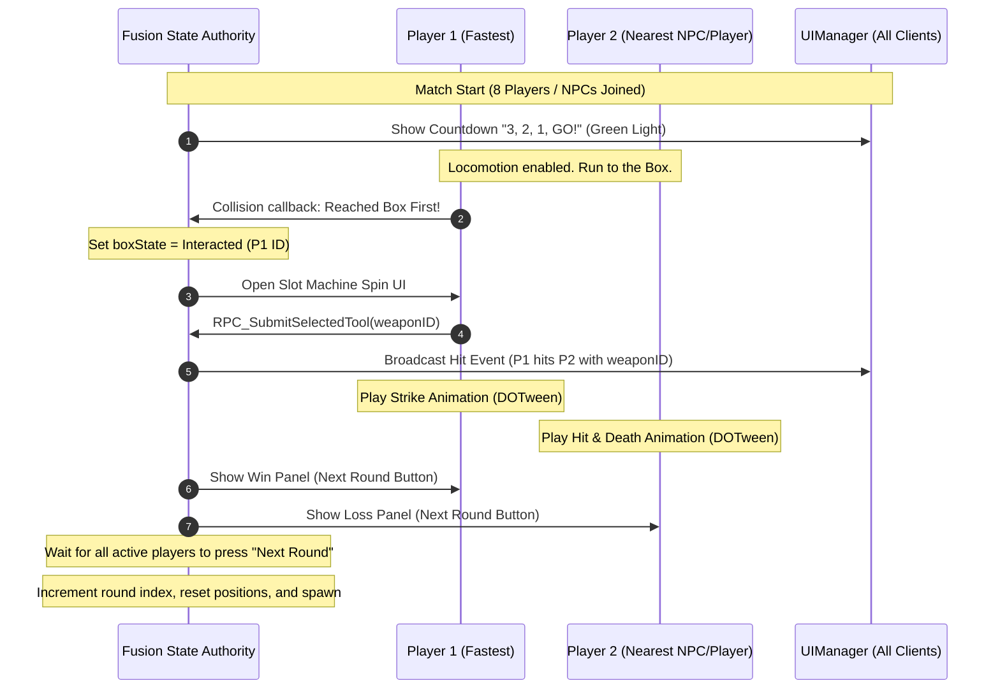

# Mob Squad Multiplayer Mode — Implementation Plan

This document outlines the detailed architecture, network flows, and animation plans to implement the 8-player competitive multiplayer survival mode for the **Mob Squad** mini-game, using **Photon Fusion** and **DOTween**.

---

## 1. Core Mechanics & Sequence Flow



---

## 2. Multiplayer Architecture & Photon Fusion Integration

To support up to 8 players (both human players and NPC fallbacks), we will introduce a new manager component: `MobSquadGameManager`.

### 2.1 Networking States & Properties
The `MobSquadGameManager` (inheriting from `NetworkBehaviour`) will maintain the following synchronized states:

```csharp
[Networked, ChangedTo(nameof(OnGameStateChanged))]
public MobSquadState CurrentState { get; set; }

[Networked]
public int CurrentRound { get; set; } // 1, 2, or 3

[Networked]
public NetworkDictionary<PlayerRef, NetworkBool> NextRoundReady { get; }

[Networked]
public NetworkDictionary<int, NetworkBool> NPCReadyStates { get; }

[Networked]
public NetworkString<_32> WinnerUsername { get; set; }

[Networked]
public PlayerRef WinnerPlayerRef { get; set; }
```

### 2.2 Connection & NPC Fallback (10-Second Rule)
1. **Lobby Matchmaking**: When the player enters the lobby, a 10-second timer begins (`MatchmakingManager`).
2. **If Online Players Connect**: They join the same Fusion session.
3. **If 10 Seconds Elapse**: If fewer than 8 players are in the room, the Host automatically instantiates NPC bots (`pangopal_01` prefabs) with basic steering/navmesh AI scripts to fill the remaining slots up to 8 total characters.

---

## 3. Spawning & Locomotion

- **Spawn Locations**: The scene has a `Spawn-Green-Line` containing 8 spawn transforms.
- **Random Assignment**: On round initialization, the Host shuffles the spawn points and assigns them to the players and NPCs.
- **Steering Control**: 
  - **Human Players**: Move via [SimpleMobileJoystick](file:///C:/Users/User/Documents/GitHub/unity.deonphizzle.stone-hammer-saw/Assets/Scripts/Controller/SimpleMobileJoystick.cs) or Keyboard WASD inputs.
  - **NPC Bots**: Controlled by a simple pathfinding behavior seeking the Box's coordinates.

---

## 4. Interaction, Selection & Combat Resolution

### 4.1 Box Reach Trigger
- The **Mystical Box** is equipped with a triggers collider.
- The first network character (Player or NPC) whose collider enters the trigger registers as the round winner.
- The server locks the Box state using a networked boolean to prevent concurrent activations.

### 4.2 Slot Machine Spin UI
- The player who reached the box first gets their UI activated with the fast-scrolling [SlotMachineManager](file:///C:/Users/User/Documents/GitHub/unity.deonphizzle.stone-hammer-saw/Assets/Scripts/Controller/SlotMachineManager.cs).
- For NPCs, a simple timer runs for 1.5 seconds, then randomly snaps to a weapon.

### 4.3 Target Selection & Strike
- Once a weapon is selected, the server calculates the nearest active opponent (second character) in 3D distance.
- An RPC is broadcast to trigger the strike sequence on all client views:
  1. The winning character plays a strike animation (bone rotation override using DOTween).
  2. The target character is hit and plays a custom death animation (e.g., spin, flatten, scale down to zero, or fall over via DOTween).

---

## 5. Round Transitions & UI Flow

- **Rounds**: Matches play for a maximum of 3 rounds.
- **Game Over Panels**:
  - **Winner**: Displays a customized "Victory" overlay.
  - **Losers**: Display "Defeat" overlays.
  - Both overlays contain a **Next Round** button.
- **Next Round Sync**:
  - Tapping **Next Round** sends an RPC setting the player's ready state to `true`.
  - When all connected human players (and AI bots) are ready, the Host increments `CurrentRound`, resets player positions back to the Green Line, and starts the next round.
  - If the match reaches 3 rounds, the player is returned to the main lobby.

---

## 6. Detailed Animation Specs (DOTween)

| Target Asset | Animation Action | DOTween Parameters |
| :--- | :--- | :--- |
| **Winning Player** | Strike Charge-Up | `transform.DOMoveForward(...)` and `upperArm.DOLocalRotate(...)` |
| **Target Player** | Hit Reaction & Death | `transform.DOPunchPosition(...)` followed by `transform.DOScale(0, 0.6f)` & `transform.DORotate(...)` |
| **Status Texts** | Red/Green Transitions | `statusText.transform.DOScale(Vector3.one, 0.35f).SetEase(Ease.OutBack)` |
