# Slot Machine Implementation Plan (Completed)

This document outlines the visual analysis, scene architecture, and final technical implementation details of the weapon selection slot machine upgrade in the **Mob Squad 3D World Scene** using **DOTween** animations, a 5-second timer, arrow animations, and center pop-up selection VFX.

---

## 1. System Status & Verification Dashboard

| Feature / Requirement | Target Behavior | Status | Verification Detail |
| :--- | :--- | :---: | :--- |
| **Centralized Control** | Single manager controls all columns and arrows; scroller scripts removed from individual columns. | **Completed** | Component attached to `WeaponSelect manager` GameObject. References wired to the 3 columns and arrows. |
| **Infinite Translation** | Translate and wrap images downwards using original custom translation math. | **Completed** | Custom threshold detection and overshoot wrapping logic preserved. |
| **5s Timer & Spin Loop** | Spin at target speed for 5 seconds on launch or trigger, then initiate deceleration. | **Completed** | Handles automatic spin on start and context-menu triggering via `StartSpin()` routine. |
| **Staggered Deceleration** | Columns decelerate sequentially (Left $\rightarrow$ Mid $\rightarrow$ Right) over `1.0s` each. | **Completed** | Staggered using `DOTween.To` with `Ease.OutQuad` and `WaitForCompletion()` in a coroutine. |
| **Elastic Snapping** | Snap columns to design-time grid alignments with a mechanical bounce. | **Completed** | Distance wrapping calculations followed by `DOAnchorPosY` with `Ease.OutBack`. |
| **Arrow Down Pulse** | Sequentially pulse/down-move top arrows in `Upper-Bg` without breaking layout. | **Completed** | Left $\rightarrow$ Mid $\rightarrow$ Right sequential sequence loop using yoyo DOTween scale/position offsets. |
| **VFX Center Pop-Up** | Pop selected weapon to center, scale by `1.8x`, spin 360°, and pulse neon cyan. | **Completed** | Reparented dynamically to panel, overridden sorting layer with dynamic canvas, and center tweened. |

---

## 2. Slot Machine Lifecycle & State Transitions

The diagram below illustrates the complete state cycle of the centralized slot machine controller:

```mermaid
stateDiagram-v2
    [*] --> IdleStart : Start() Called
    IdleStart --> Spinning : Initialize Speeds & Trigger AutoSpinStopRoutine()
    
    state Spinning {
        [*] --> ScrollUpdate : Columns Scroll Downward at targetScrollSpeed
        ScrollUpdate --> WrapCheck : Check bottomThreshold
        WrapCheck --> WrapPosition : Y <= bottomThreshold (with overshoot correction)
        WrapPosition --> ScrollUpdate
    }
    
    Spinning --> Stopping : 5-Second Timer Expires
    
    state Stopping {
        [*] --> StopCol0 : Tween columns[0] Speed to 0 (1s, Ease.OutQuad)
        StopCol0 --> SnapCol0 : Elastic Snap column[0] (Ease.OutBack)
        SnapCol0 --> WaitStagger1 : Wait 0.4s
        WaitStagger1 --> StopCol1 : Tween columns[1] Speed to 0 (1s, Ease.OutQuad)
        StopCol1 --> SnapCol1 : Elastic Snap column[1] (Ease.OutBack)
        SnapCol1 --> WaitStagger2 : Wait 0.4s
        WaitStagger2 --> StopCol2 : Tween columns[2] Speed to 0 (1s, Ease.OutQuad)
        StopCol2 --> SnapCol2 : Elastic Snap column[2] (Ease.OutBack)
    }

    Stopping --> Selection : Select Weapon (Middle Column, Center Image)
    
    state Selection {
        [*] --> SpawnDimOverlay : Instantiate DimOverlay & Fade Alpha to 0.75
        SpawnDimOverlay --> ReparentWeapon : Reparent Selected Image to Panel Parent (1,1,1 scale)
        ReparentWeapon --> OverlaySorting : Add Canvas (Override sortingOrder = 105) & Raycaster
        OverlaySorting --> AnimateCenter : Tween to (0,0), Scale up 1.8x, Rotate 360°
        AnimateCenter --> GlowPulse : Start Neon Cyan loop (DOColor, LoopType.Yoyo)
    }
    
    Selection --> ResetState : StartSpin() Triggered
    
    state ResetState {
        [*] --> KillTweens : Kill GlowPulse & Image Tweens
        KillTweens --> RestoreHierarchy : Reparent Image back to Column Parent & original Sibling Index
        RestoreHierarchy --> RestoreValues : Reset original localPosition, localScale, localRotation
        RestoreValues --> CleanComponents : Destroy added Canvas & GraphicRaycaster, Destroy DimOverlay
    }
    
    ResetState --> Spinning : Automatically start spin or accelerate Column Speeds to targetScrollSpeed (0.5s)
```



---

## 3. Configuration Parameters

The `WeaponSelect manager` exposes the following settings in the Inspector to control scrolling, timings, and VFX:

| Parameter | Type | Default Value | Description |
| :--- | :--- | :--- | :--- |
| **Columns** | `SlotColumn[]` | Array of 3 | Houses references to each column's name and its child slot image `RectTransform` components. |
| **Target Scroll Speed** | `float` | `500.0` | Maximum vertical scroll speed of columns during the active spin. |
| **Bottom Threshold** | `float` | `-300.0` | Lower coordinate boundary at which slot images wrap to the top. |
| **Reset Position Y** | `float` | `300.0` | Target upper coordinate to reset wrapped slot images to (minus overshoot). |
| **Arrow Images** | `RectTransform[]` | Array of 3 | References to `Arrow Left`, `Arrow Mid`, and `Arrow  Right` in `Upper-Bg`. |
| **Arrow Animation Speed** | `float` | `0.5` | Cycle duration of the sequential pulsing arrow wave. |
| **Dim Alpha** | `float` | `0.75` | Target transparency of the dark background overlay upon weapon selection. |
| **Select Scale Multiplier**| `float` | `1.8` | Size multiplier applied to the selected weapon in uniform parent space. |
| **Select Tween Duration** | `float` | `0.5` | Duration of the center fly-in, scale, and rotate animations. |

---

## 4. Technical Implementation Details & Bug Resolutions

### 4.1 Resolution of Selected Weapon Scale & Centering Bug

> [!WARNING]
> **Hierarchy Scale Distortion**
> The parent columns (`HeadlineFContainer` siblings) are highly stretched vertically (Y local scale = `21.139`) while the slot images scale down locally (Y local scale = `0.255`) to compensate. Simply scaling the selected weapon up locally inside its column stretches it vertically by nearly **7x**, creating a severely distorted sprite.

To fix both the scale distortion and alignment bounds constraints, the script performs a dynamic reparenting routine during selection, converting all coordinates and scale calculations to the uniform parent space of the canvas panel.

```csharp
// Cache original hierarchy values to restore on subsequent spin reset
originalParent = bestImage.parent;
originalSiblingIndex = bestImage.GetSiblingIndex();
originalAnchoredPosition = bestImage.anchoredPosition;
originalLocalScale = bestImage.localScale;
originalAnchorMin = bestImage.anchorMin;
originalAnchorMax = bestImage.anchorMax;
originalPivot = bestImage.pivot;

// 1. Create dim overlay behind columns
dimOverlay = new GameObject("DimOverlay", typeof(RectTransform), typeof(CanvasRenderer), typeof(UnityEngine.UI.Image));
dimOverlay.transform.SetParent(this.transform.parent, false);
dimOverlay.transform.SetSiblingIndex(this.transform.GetSiblingIndex());

var rect = dimOverlay.GetComponent<RectTransform>();
rect.anchorMin = Vector2.zero;
rect.anchorMax = Vector2.one;
rect.sizeDelta = Vector2.zero;

var imgComp = dimOverlay.GetComponent<UnityEngine.UI.Image>();
imgComp.color = new Color(0, 0, 0, 0);
imgComp.DOColor(new Color(0, 0, 0, dimAlpha), selectTweenDuration);

// Implementation of 5-step centering fix:
// 1. Store the bestImage.position (world position) in a temporary variable.
Vector3 storedWorldPosition = bestImage.position;

// 2. Reparent the bestImage to this.transform.parent (using worldPositionStays: true).
bestImage.SetParent(this.transform.parent, true);

// 3. Set bestImage.anchorMin, bestImage.anchorMax, and bestImage.pivot all to new Vector2(0.5f, 0.5f).
bestImage.anchorMin = new Vector2(0.5f, 0.5f);
bestImage.anchorMax = new Vector2(0.5f, 0.5f);
bestImage.pivot = new Vector2(0.5f, 0.5f);

// 4. Immediately re-apply the stored world position so the image doesn't visually jump when the anchors change.
bestImage.position = storedWorldPosition;

// Cache scale converted to the panel's uniform space
currentlySelectedImageOriginalScale = bestImage.localScale;

// 3. Bring selected image to the front using sorting override
addedCanvas = bestImage.gameObject.AddComponent<Canvas>();
addedCanvas.overrideSorting = true;
addedCanvas.sortingOrder = 105;

addedRaycaster = bestImage.gameObject.AddComponent<UnityEngine.UI.GraphicRaycaster>();

// 5. Animate to center, scale up, and rotate in uniform space
bestImage.DOAnchorPos(Vector2.zero, selectTweenDuration).SetEase(Ease.OutBack);
bestImage.DOScale(currentlySelectedImageOriginalScale * selectScaleMultiplier, selectTweenDuration).SetEase(Ease.OutBack);
bestImage.DORotate(new Vector3(0, 0, 360f), selectTweenDuration, RotateMode.FastBeyond360).SetEase(Ease.OutQuad);
```

---

### 4.2 Selection Neon Cyan Glow Effect

Once the selected weapon reaches the center, it starts a looping neon cyan color pulse using `DOColor` with `LoopType.Yoyo` under a unique tween ID so it can be killed immediately upon resetting:

```csharp
// 5. Cyan glow pulse loop effect
var neonColor = new Color(0f, 1f, 1f, 1f); // Neon Cyan
var weaponImage = bestImage.GetComponent<UnityEngine.UI.Image>();
if (weaponImage != null)
{
    weaponImage.DOColor(neonColor, 0.4f).SetLoops(-1, LoopType.Yoyo).SetId("GlowPulse");
}
```

When a new spin is triggered, `ResetSelection()` runs to restore the layout cleanly:

```csharp
private void ResetSelection()
{
    if (currentlySelectedImage != null)
    {
        // Kill glow pulse tween and restore white tint
        DOTween.Kill("GlowPulse");
        var weaponImage = currentlySelectedImage.GetComponent<UnityEngine.UI.Image>();
        if (weaponImage != null) weaponImage.color = Color.white;

        // Kill active tweens on the image RectTransform
        currentlySelectedImage.DOKill();

        // Reparent back to original column parent
        currentlySelectedImage.SetParent(originalParent, true);
        currentlySelectedImage.SetSiblingIndex(originalSiblingIndex);

        // Restore original local values and anchors/pivot
        currentlySelectedImage.anchorMin = originalAnchorMin;
        currentlySelectedImage.anchorMax = originalAnchorMax;
        currentlySelectedImage.pivot = originalPivot;
        currentlySelectedImage.anchoredPosition = originalAnchoredPosition;
        currentlySelectedImage.localRotation = Quaternion.identity;
        currentlySelectedImage.localScale = originalLocalScale;

        // Clean up components added for rendering overlay sorting
        if (addedRaycaster != null) Destroy(addedRaycaster);
        if (addedCanvas != null) Destroy(addedCanvas);
        currentlySelectedImage = null;
    }

    if (dimOverlay != null) Destroy(dimOverlay);
}
```

---

### 4.3 Staggered Deceleration & Elastic Snapping Math

Deceleration maps the scroll speed to `0` over `1.0s` via an `Ease.OutQuad` transition. Once stopped, we calculate the wrap-aware alignment offset needed to snap each image back to its design-time spacing layout:

```csharp
float L = resetPositionY - bottomThreshold;
float spacing = L / col.slotImages.Length;
float currentY = col.slotImages[0].anchoredPosition.y;
float initialY = col.initialPositions[0].y;

// Compute alignment shift
float diff = currentY - initialY;
float wrappedDiff = Mathf.Repeat(diff + L / 2f, L) - L / 2f;
float k = Mathf.Round(wrappedDiff / spacing);
float targetDiff = k * spacing;
float shift = targetDiff - wrappedDiff;

// Animate shift via DOTween with Ease.OutBack to achieve elastic snapping bounce
for (int i = 0; i < col.slotImages.Length; i++)
{
    if (col.slotImages[i] == null) continue;
    float startY = col.slotImages[i].anchoredPosition.y;
    float targetY = startY + shift;

    col.slotImages[i].DOAnchorPosY(targetY, 0.4f).SetEase(Ease.OutBack);
}
```

---

### 4.4 Resolution of Top Arrow Spacing & Double-Space Bug

> [!IMPORTANT]
> **Hierarchy Double-Space Bug**
> The third arrow GameObject in the hierarchy is named `"Arrow  Right"` (containing a double space between the words). Regular string checks searching for `"Arrow Right"` failed to bind the reference, causing the right arrow to remain static and ruining the visual balance.

To correct this, the setup scripts inspect string elements and support both naming patterns. Additionally, caching original arrow scales and Y positions before animating prevents cumulative aspect ratio degradation and visual drift. Upon weapon selection, the arrows stop animating and smoothly snap back to their default shapes and positions.

```csharp
private void StartArrowAnimation()
{
    if (arrowImages == null || arrowImages.Length == 0 || arrowOriginalScales == null || arrowOriginalYPositions == null) return;

    Sequence seq = DOTween.Sequence();
    for (int i = 0; i < arrowImages.Length; i++)
    {
        if (arrowImages[i] == null) continue;
        RectTransform arrow = arrowImages[i];
        Vector3 originalScale = arrowOriginalScales[i];
        float originalY = arrowOriginalYPositions[i];
        
        seq.Insert(i * 0.2f, arrow.DOScale(originalScale * 1.3f, 0.3f).SetLoops(2, LoopType.Yoyo));
        seq.Insert(i * 0.2f, arrow.DOAnchorPosY(originalY - arrowMoveDistance, 0.3f).SetLoops(2, LoopType.Yoyo));
    }

    seq.SetLoops(-1);
    arrowSequenceTween = seq;
}

private void StopAndResetArrows()
{
    if (arrowSequenceTween != null)
    {
        arrowSequenceTween.Kill();
    }

    if (arrowImages != null && arrowOriginalScales != null && arrowOriginalYPositions != null)
    {
        for (int i = 0; i < arrowImages.Length; i++)
        {
            if (arrowImages[i] != null)
            {
                arrowImages[i].DOKill();
                arrowImages[i].DOScale(arrowOriginalScales[i], 0.2f);
                arrowImages[i].DOAnchorPosY(arrowOriginalYPositions[i], 0.2f);
            }
        }
    }
}
```

---

## 5. Scene Modifications Workflow

The implementation migration was carried out in the editor through the following steps:

1. **Scene Setup Verification**: Opened the active scene [Mob Squad 3d world scene.unity](file:///C:/Users/User/Documents/GitHub/unity.deonphizzle.stone-hammer-saw/Assets/Scenes/Mob%20Squad%203d%20world%20scene.unity) in Edit Mode.
2. **Created Controller**: Created the empty GameObject `WeaponSelect manager` as a sibling in the canvas structure.
3. **Migrated Components**: Attached the updated `SlotMachineScroller` script component to `WeaponSelect manager`. Removed the individual instances of `SlotMachineScroller` from the columns (`HeadlineFContainer`, `HeadlineFContainer (1)`, and `HeadlineFContainer (2)`) to consolidate control.
4. **Wired References**: Populated all column structure arrays, child slot images, and arrow images (`Arrow Left`, `Arrow Mid`, `Arrow  Right`) under the manager inspector fields.
5. **Saved Scene Assets**: Saved and serialized all changes back to disk.
